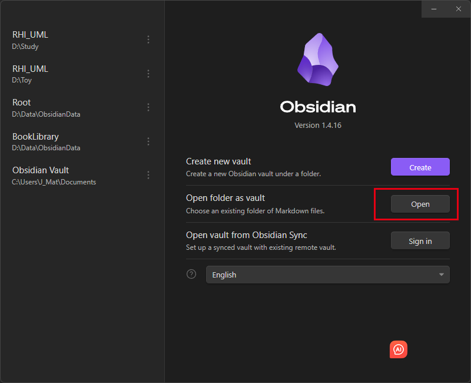
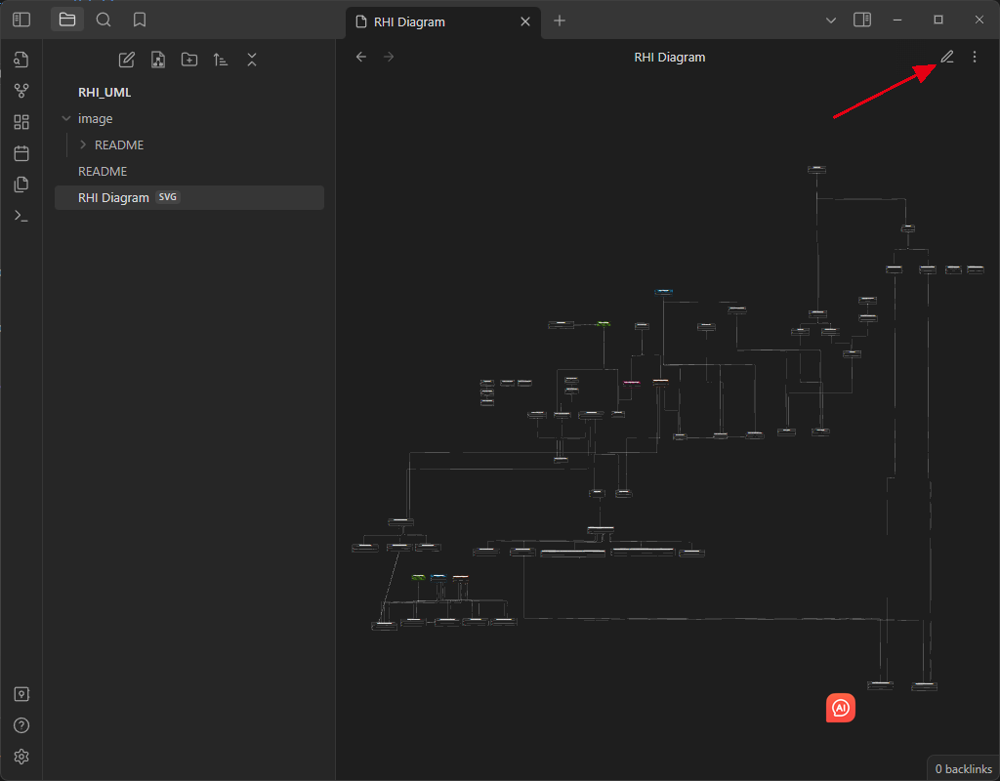
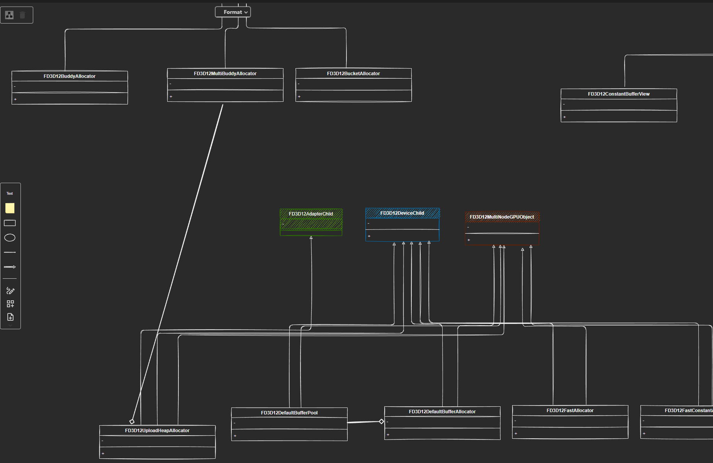

# RHI_UML

UnrealEngine's RHI note

## How to use it

### Step 1

git clone [J-Mat/RHI_UML: UnrealEngine&#39;s RHI note (github.com)](https://github.com/J-Mat/RHI_UML)

### Step 2

Download Obsidian 

[Obsidian - Sharpen your thinking](https://obsidian.md/)

### Step 3

Open Obsidian, click ****Open****

### Step 4

Open it!

### Step 5

Click the EditMode

## Enjoy it !

